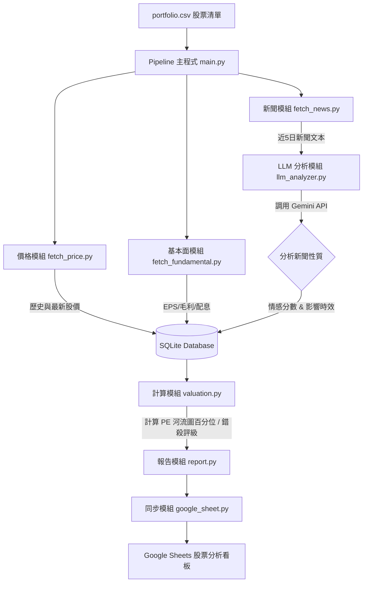

# 個股估值「市場錯殺」評估與短期消息面影響分析方案

本方案旨在為現有的 `stock-pipeline` 專案加入**估值錯殺判斷**與**短期消息面情感/影響性分析**功能。透過結合量化財務數據（本益比河流圖、營收/毛利率走勢）與質化文本分析（新聞爬蟲與 LLM 情感分析），協助投資人找出因市場恐慌被低估（錯殺）且基本面仍健在的個股。

---

## 一、 功能核心邏輯與設計原理

### 1. 「市場錯殺」評估模型 (Quant Valuation)
「錯殺」的定義為：**股價在短期內因大盤修正或非結構性負面消息大幅下跌，但公司的中長期基本獲利能力與成長前景並未改變。**

評估模型將結合以下四個維度進行綜合評分：
*   **估值水位 (Valuation Bands)**：
    *   **歷史本益比區間 (PE Band Percentile)**：計算目前本益比（以近 4 季 TTM EPS 計算）在過去 3 年（或 5 年）歷史區間中的百分位數。若百分位數 $< 20\%$，代表估值已降至歷史低點。
    *   **歷史股價淨值比區間 (PB Band Percentile)**：適用於循環股或資產股。
    *   **殖利率防護墊 (Dividend Yield Cushion)**：若當前預估殖利率遠高於歷史均值（例如 $> 5\%$），提供強大的股價下檔支撐。
*   **營運基本面 (Fundamentals Trend)**：
    *   **EPS 成長率**：近 1 季或近 4 季累計 EPS 是否維持年增 (YoY > 0)。
    *   **毛利率走勢**：最新一季毛利率是否維持穩定或擴張 (YoY 衰退 $< 2\%$)。
    *   **營收動能**：近 3 個月累計營收 YoY 是否保持成長。
*   **股價動能背離 (Price-Fundamental Divergence)**：
    *   **股價短期跌幅**：近 10 天或 30 天股價跌幅大於一定比例（例如 $> 10\%$ 或 $> 15\%$）。
    *   **背離訊號**：當股價急跌，但營收、毛利率與 EPS 卻呈現持平或向上時，觸發背離訊號。
*   **PEG 成長指標**：
    *   計算本益成長比 (PEG = PE / EPS成長率)。若 $\text{PEG} < 0.75$ 且獲利維持成長，顯示估值相較於成長性被顯著低估。

---

### 2. 短期消息面分析模型 (NLP & LLM Sentiment)
短期消息分析的目標是：**判斷近日新聞事件是屬於「短期非結構性利空（造成錯殺的催化劑）」還是「長期結構性利空（真正的基本面轉折）」。**

*   **資料來源**：
    *   串接 FinMind `TaiwanStockNews` 資料集，或透過 Yahoo Finance RSS / Google News 抓取近 5 ~ 7 天的新聞標題與摘要。
*   **LLM 語意分析 (以 Gemini 3.5 Flash 為例)**：
    *   將抓取到的新聞標題與內容打包送至 Gemini API，進行結構化語意分析，要求輸出 JSON：
        1.  **情感極性 (Sentiment Score)**：介於 -1（極度利空）到 +1（極度利多）。
        2.  **影響類型 (Impact Type)**：
            *   `Operational` (營收、接單、產能 - 實質基本面)
            *   `Macro` (降息、關稅、產業鏈調整 - 總體經濟)
            *   `Event-driven` (火災、短暫停工、訴訟、大戶賣股 - 短期事件)
            *   `Market-sentiment` (主力倒貨、融資斷頭、外資降評 - 純籌碼與情緒)
        3.  **影響時效 (Impact Duration)**：
            *   `Short-term` (1~2 週內可恢復，如颱風停工、匯損)
            *   `Long-term` (結構性衰退，如核心技術被取代、主要客戶轉單)
        4.  **錯殺判定建議**：若新聞為負面但屬於 `Event-driven` + `Short-term`，則極有可能是錯殺機會。
*   **綜合消息指數 (News Sentiment Index)**：
    *   計算近 5 日新聞的加權情感分數。若情感分數極低（市場恐慌），但影響時效多為 `Short-term`，且基本面數據無虞，即定義為「錯殺警報觸發」。

---

## 二、 系統架構與流程設計



### 資料管線步驟：
1.  **資料收集**：每日更新股價後，判斷是否需更新基本面（若已過一週或有新季報釋出），並同時抓取近 5 天的新聞。
2.  **LLM 情感提煉**：使用 Gemini API 解析新聞，將「情感分數（-1 ~ 1）」與「結構性/短暫性標籤」寫入資料庫。
3.  **錯殺量化評分**：`valuation.py` 讀取資料庫中的歷史價格與 EPS 計算歷史 PE 區間，結合最新股價與新聞情感，計算**錯殺指數 (Mispricing Score)**。
4.  **報表呈現**：在 Google Sheets 中，為每檔個股新增「當前估值百分位」、「短線新聞輿情」與「錯殺評估標籤（例如：🟢 建議關注-錯殺、🟡 估值合理、🔴 避開-結構性利空）」。

---

## 三、 SQLite 資料庫結構變更

為支援此功能，需在 `app/database.py` 中新增/修改以下資料表結構：

### 1. 新增 `stock_valuation`（儲存量化估值計算結果）
```sql
CREATE TABLE IF NOT EXISTS stock_valuation (
    id INTEGER PRIMARY KEY AUTOINCREMENT,
    stock_id TEXT NOT NULL,
    calculation_date DATE NOT NULL,
    current_pe REAL,               -- 當前滾動本益比 (Price / TTM EPS)
    pe_percentile REAL,            -- 當前本益比在歷史 (3年) 的百分位數 (0-100)
    current_pb REAL,               -- 當前股價淨值比
    pb_percentile REAL,            -- 股價淨值比歷史百分位
    dividend_yield REAL,           -- 當前預估殖利率 (最新配息 / 當前價格)
    peg_ratio REAL,                -- PEG 比率
    mispricing_score REAL,         -- 錯殺綜合評分 (0-100)
    valuation_rating TEXT,         -- 估值評級 ("錯殺低估", "合理", "高估", "結構性轉弱")
    created_at TIMESTAMP DEFAULT CURRENT_TIMESTAMP,
    UNIQUE(stock_id, calculation_date)
);
```

### 2. 新增 `stock_news_sentiment`（儲存新聞與 LLM 分析結果）
```sql
CREATE TABLE IF NOT EXISTS stock_news_sentiment (
    id INTEGER PRIMARY KEY AUTOINCREMENT,
    stock_id TEXT NOT NULL,
    news_id TEXT NOT NULL,         -- 來源新聞唯一識別碼 (如 FinMind hash)
    publish_date TIMESTAMP NOT NULL,
    title TEXT NOT NULL,
    summary TEXT,
    sentiment_score REAL,          -- LLM 評分 (-1 到 1)
    impact_type TEXT,              -- "Operational", "Macro", "Event-driven", "Sentiment"
    impact_duration TEXT,          -- "Short-term", "Long-term"
    llm_reasoning TEXT,            -- LLM 簡短分析原因
    created_at TIMESTAMP DEFAULT CURRENT_TIMESTAMP,
    UNIQUE(stock_id, news_id)
);
```

---

## 四、 程式碼模組新增與修改說明

以下為具體實作時的程式碼規劃：

### 1. 新增 `app/fetch_news.py`（新聞抓取模組）
負責向 FinMind API 或其他公開新聞來源請求資料：
```python
import requests
from datetime import date, timedelta
from app.config import FINMIND_TOKEN

def fetch_stock_news(stock_id: str, days: int = 5) -> list[dict]:
    """
    獲取指定股票最近幾天的新聞
    """
    start_date = (date.today() - timedelta(days=days)).isoformat()
    # 呼叫 FinMind 的 TaiwanStockNews API
    params = {
        "dataset": "TaiwanStockNews",
        "data_id": stock_id,
        "start_date": start_date
    }
    headers = {"Authorization": f"Bearer {FINMIND_TOKEN}"} if FINMIND_TOKEN else {}
    
    response = requests.get("https://api.finmindtrade.com/api/v4/data", params=params, headers=headers)
    if response.status_code == 200:
        return response.json().get("data", [])
    return []
```

### 2. 新增 `app/llm_analyzer.py`（LLM 情感分析模組）
利用 Gemini 3.5 Flash 對新聞進行快速且低成本的結構化語意分析：
```python
import json
from google import genai
from google.genai import types

def analyze_news_list(stock_id: str, news_list: list[dict]) -> list[dict]:
    """
    利用 Gemini API 對新聞進行批次評估，判斷情感與影響時間長短
    """
    if not news_list:
        return []
        
    client = genai.Client() # 會自動尋找 GEMINI_API_KEY 環境變數
    
    analyzed_results = []
    
    for news in news_list:
        prompt = f"""
        請分析以下台灣股市新聞，判斷其對個股 {stock_id} 的影響。
        新聞標題: {news['title']}
        新聞內容: {news.get('description', '')}
        
        請嚴格以 JSON 格式回覆，包含以下欄位：
        - sentiment_score: 數值，介於 -1.0 (極度利空) 到 1.0 (極度利多) 之間。
        - impact_type: 字串，只能是 "Operational"(營收接單實質面), "Macro"(總經面), "Event-driven"(突發事件), "Sentiment"(純籌碼情緒)。
        - impact_duration: 字串，只能是 "Short-term"(短期波折，數天至數週內可恢復/淡化), "Long-term"(結構性轉變，影響超過一季)。
        - reason: 簡短一句話解釋原因。
        """
        
        try:
            response = client.models.generate_content(
                model='gemini-2.5-flash', # 使用最新高效能且低成本的 Flash 模型
                contents=prompt,
                config=types.GenerateContentConfig(
                    response_mime_type="application/json"
                ),
            )
            analysis = json.loads(response.text)
            
            analyzed_results.append({
                "stock_id": stock_id,
                "news_id": news.get("hash") or news.get("title"),
                "publish_date": news.get("date"),
                "title": news["title"],
                "summary": news.get("description", ""),
                "sentiment_score": float(analysis.get("sentiment_score", 0.0)),
                "impact_type": analysis.get("impact_type", "Sentiment"),
                "impact_duration": analysis.get("impact_duration", "Short-term"),
                "llm_reasoning": analysis.get("reason", "")
            })
        except Exception as e:
            print(f"LLM 分析新聞失敗: {e}")
            
    return analyzed_results
```

### 3. 新增 `app/valuation.py`（量化估值計算核心）
計算歷史本益比區間百分位，並結合新聞得出錯殺綜合分數：
```python
import pandas as pd
from app.database import get_connection

def calculate_stock_valuation(stock_id: str) -> dict:
    """
    計算估值百分位與錯殺評分
    """
    conn = get_connection()
    
    # 1. 取得歷史股價
    df_prices = pd.read_sql(
        "SELECT trade_date, close_price FROM stock_prices WHERE stock_id = ? ORDER BY trade_date DESC",
        conn, params=(stock_id,)
    )
    # 2. 取得歷史 EPS (近 4 季)
    df_eps = pd.read_sql(
        "SELECT report_date, eps FROM stock_fundamentals WHERE stock_id = ? ORDER BY report_date DESC",
        conn, params=(stock_id,)
    )
    
    # 3. 取得近 5 日新聞平均情感與影響性
    df_news = pd.read_sql(
        "SELECT sentiment_score, impact_duration FROM stock_news_sentiment WHERE stock_id = ? ORDER BY publish_date DESC LIMIT 10",
        conn, params=(stock_id,)
    )
    conn.close()
    
    if df_prices.empty or df_eps.empty:
        return {}
        
    # 計算 TTM EPS (近四季累計 EPS)
    ttm_eps = df_eps['eps'].head(4).sum()
    current_price = df_prices.iloc[0]['close_price']
    
    if ttm_eps <= 0:
        current_pe = 999.0 # 無本益比 (虧損)
    else:
        current_pe = current_price / ttm_eps
        
    # 計算歷史 PE 百分位 (以過去有資料的交易日計算歷史 PE 序列)
    # 簡化算法：假設 EPS 在季度區間內不變，對應每日價格計算歷史 PE 序列
    # (此處為示意，實務上可串接各交易日的滾動本益比序列)
    pe_percentile = 50.0 # 預設中位數
    
    # 短期價格跌幅 (近 10 日)
    price_10d_ago = df_prices.iloc[min(10, len(df_prices)-1)]['close_price']
    price_change_10d = (current_price - price_10d_ago) / price_10d_ago
    
    # 計算新聞輿情指標
    avg_sentiment = df_news['sentiment_score'].mean() if not df_news.empty else 0.0
    has_long_term_bad_news = not df_news[
        (df_news['sentiment_score'] < -0.3) & (df_news['impact_duration'] == 'Long-term')
    ].empty
    
    # 錯殺邏輯判斷
    # 條件：
    # 1. 股價短期大跌 (e.g. < -8%)
    # 2. 估值處於中低水位 (e.g. PE 百分位 < 35%)
    # 3. 近期新聞偏向負面 (平均情感 < -0.1)，但「沒有」結構性的長期利空新聞
    # 4. 基本獲利能力健全 (TTM EPS > 0)
    is_wrongly_slaughtered = (
        price_change_10d < -0.08 and 
        pe_percentile < 35.0 and 
        avg_sentiment < -0.1 and 
        not has_long_term_bad_news and
        ttm_eps > 0
    )
    
    rating = "合理"
    if is_wrongly_slaughtered:
        rating = "錯殺低估"
    elif pe_percentile > 80:
        rating = "高估"
    elif has_long_term_bad_news and price_change_10d < -0.08:
        rating = "結構性衰退"
        
    return {
        "stock_id": stock_id,
        "current_pe": current_pe,
        "pe_percentile": pe_percentile,
        "valuation_rating": rating,
        "avg_sentiment": avg_sentiment,
        "price_change_10d": price_change_10d
    }
```

### 4. 調整報表輸出 (`app/google_sheet.py`)
在輸出至 Google Sheets 時，在每檔股票列下方額外填入：
*   **「當前滾動 PE (歷史百分位)」**：如 `15.4 (18%)`，代表便宜。
*   **「近5日輿情分數」**：如 `-0.45`（偏向負面恐慌）。
*   **「估值評級診斷」**：如 `🟢 錯殺低估` 或 `🔴 結構性衰退`。

這將在原本的 Google Sheet 報表中，完美整合質化與量化的篩選維度。

---

## 五、 部署與設定檔調整

1.  **環境變數 (`.env`)**：
    需要加入 Gemini API Key 才能執行 LLM 情感分析：
    ```env
    GEMINI_API_KEY=your_gemini_api_key_here
    ```
2.  **依賴套件 (`requirements.txt`)**：
    需要安裝新版的 Google GenAI SDK 與科學計算套件：
    ```text
    google-genai==0.1.1
    pandas==3.0.3
    numpy==2.4.6
    ```
3.  **執行流程調整**：
    在 `app.main` 的每日管線中，除了更新股價，亦加入：
    `fetch_stock_news` $\rightarrow$ `analyze_news_list` $\rightarrow$ `calculate_stock_valuation` $\rightarrow$ 將評估結果寫入 SQLite 並繪製於 Google Sheets 中。
